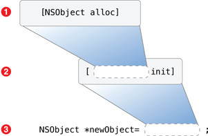

# 使用对象
在一个 Objective-C 应用中大部分的工作是由于消息跨越对象的生态系统被送回和送达而产生的。这些对象中的一部分是由 Cocoa 或者 Cocoa Touch 所提供的类的实例，一部分是你自己的类的实例。

前一章描述了来为一个类定义接口和实现的语法，其中也包括了实现包含为响应消息而需要被执行的代码的方法的语法。这一章解释了如何给一个对象发送这样一条消息，并涵盖了 Objective-C 的一些动态特征，包括动态类型和决定哪个方法应当在运行时被调用的能力。

在一个对象能够被使用前，它必须结合为它的属性所做的内存分配和内部值的初始化以被正确地创建。这一章描述了如何嵌套方法调用来分配和初始化一个对象来保证它是被正确配置的。

## 对象发送并且接收消息
尽管在 Objective-C 的对象间中有多种不同的方法来发送消息，到目前为止最普遍的方法是使用方括号的基础语法，像这样：

```
    [someObject doSomething];
```  

左边的引用，在这个案例中的 `someObject`，是消息的接收者。右边的消息，`doSomething`，是访问接收者的方法的名称。换句话说，当上面这行代码被执行的时候，`someObject` 将被发送消息 `doSomething`。

前一章描述了如何为一个类创建一个借口，像这样：

```
@implementation XYZPerson : NSObject  
- (void)sayHello;    
@end
```

和怎样为创建那个类的实现，像这样：

```
@implementation XYZPerson  
- (void)sayHello {  
    NSLog(@"Hello, world!");  
}
@end
```

**注解**：这个例子使用了一个 Objective-C 的字符串字面量，`@“Hello, world!”`。字符串是在 Objective-C 中几个允许为它们的创建而使用的速记文字语法的其中之一。规定`@“Hello, world!”`概念上等同于“An Objective-C string object that represents the string Hello, world!.”

字面量和对象创建将在这一章之后的[对象是被动态创建的](https://developer.apple.com/library/mac/documentation/Cocoa/Conceptual/ProgrammingWithObjectiveC/WorkingwithObjects/WorkingwithObjects.html#//apple_ref/doc/uid/TP40011210-CH4-SW7)中被进一步地解释。

假设你已经得到了一个 `XYZPerson` 的对象，你可以像这样给它发送 `sayHello`的消息：

```
[somePerson sayHello];
```

发送一条 Objective-C 的消息概念上非常像调用一个函数。[图2-1](https://developer.apple.com/library/mac/documentation/Cocoa/Conceptual/ProgrammingWithObjectiveC/WorkingwithObjects/WorkingwithObjects.html#//apple_ref/doc/uid/TP40011210-CH4-SW4)为消息`“sayHello”`展示了实际的程序流程。

**图2-1** 基本的消息程序流程


为了指定一条消息的接收者，理解指针在 Objective-C 中怎样被用来指向对象是非常重要的。


### 使用指针来跟踪对象
C 和 Objective-C 使用变量来跟踪数值，就像其他编程语言一样。  

在标准C语言中有许多基本的标量变量被定义，包括整数型，浮点数型和字符型，它们像这样被声明和赋值：

```
    int someInteger = 42;  
    float someFloatingPointNumber = 3.14f;  
```

局部变量，是在一个方法或函数中被声明的变量，像这样：

```
- (void)myMethod {  
    int someInteger = 42;  
}
```

被限定在方法中被定义的作用域中。  

在这个例子中，`someInteger` 在 `myMethod` 中被声明为一个局部变量。一旦执行到方法的闭合括号，`someInteger` 将不再可存取。当一个局部的标量变量（像一个 int 或者一个 float）消失，数值也将消失。  

Objective-C对象，相比之下，则分配得稍许不同。对象通常比方法调用的简单作用域生命更长。特别的，一个对象经常需要比那些被创建来跟踪它的原始变量要存活更久的时间。因此，一个对象的存储空间是动态地被分配和解除分配的。  

**注解**：如果你习惯于使用栈和堆，则当对象在堆上被分配时，一个局部变量是在栈上被分配的。  

这需要你使用 C语言中的指针（指向存储空间的地址）来追踪它们在存储空间中的位置，像这样：

```
- (void)myMethod {
    NSString *myString = // get a string from somewhere...
    [...]
}
```

尽管指针变量 `myString`（星号指示它的指针）的作用域受 `myMethod` 作用域的限制，它在存储空间中所指的实际的字符串对象在作用域外可能会有更长的生存时间。举例来说，它可能已经存在，或者你可能需要在其他的方法调用中传递对象。

### 你可以给方法参数传递对象  
如果你在发送一条消息时需要传递一个对象，你为方法参数中的一个提供一个对象指针。前一章描述了声明只有一个参数的方法的语法：

```
- (void)someMethodWithValue:(SomeType)value;
```

因此声明一个带有字符串对象的方法的语法，看起来是像这样的:

```
- (void)saySomething:(NSString *)greeting;
```

你可以像这样实现 `saySomething:` 的方法：

```
- (void)saySomething:(NSString *)greeting {  
    NSLog(@"%@", greeting);  
}
```

指针 `greeting` 表现得像一个局部变量并且被限制在 `saySomething:` 的作用域中。尽管它所指的真实的字符串对象先于方法调用存在，并且将在方法完成后继续存在。  

**注解**：`NSLog()`使用说明符来指示替代单元。就像C标准函数库中的 `printf()`函数。记录到控制台的字符串是通过插入提供的值（剩余的参数）来修改格式字符串（第一个参数）的结果。  

在 Objective-C 中有一个额外的可替代的单元，`%@`，用来指示一个对象。在运行时，这个说明符将随着调用 `descriptionWithLocale:`方法（如果它存在）或者提供的对象上的 `description` 方法中的一个而被替换。`description` 方法由 `NSObject` 实现用来传回类和对象的存储空间，但是许多 Cocoa 和 Cocoa Touch 的类将它重写来提供更多有用的消息。在 `NSString` 的例子中，`description` 方法简单地返回了它所代表的字符串字符。  

想要获取更多有关 `NSLog()` 和 `NSString` 类的说明符使用的消息，可参见 [String Format Specifiers](https://developer.apple.com/library/mac/documentation/Cocoa/Conceptual/Strings/Articles/formatSpecifiers.html#//apple_ref/doc/uid/TP40004265)。  

### 方法可以返回值  
就像通过方法参数传递值，方法直接返回值是有可能的。在这章中到现在每一个展示出的方法都有一个返回值类型 `void`。这个C语言的关键词 `void` 意味着一个方法不返回任何东西。  

规定返回值类型为 `int` 意味着方法返回一个标量整形数值：  

```
- (int)magicNumber;
```

方法的实现使用C语言中的 `return` 声明来指示在方法在结束执行之后被传回的值，像这样：  

```
- (int)magicNumber {  
    return 42;
}
```

忽略一个方法会返回值的事实是完全可以接受的。在这个例子中 `magicNumber` 方法除了返回一个值不做其他任何有用的事，但是像这样调用方法没有任何错误：  

```
    int interestingNumber = [someObject magicNumber];
```

你可以用相同的方法从方法中返回对象。举个例子，`NSString` 类，提供了一个 `uppercaseString` 方法:

```
- (NSString *)uppercaseString;
```

当一个方法返回一个纯数值时做法相同，尽管你需要使用一个指针来追踪结果：

```
    NSString *testString = @"Hello, world!";  
    NSString *revisedString = [testString uppercaseString];
```

当这个方法调用返回时，`revisedString` 将会指向一个代表 `Hello,world!`的 `NSString` 对象。  

记住当实现一个方法来返回一个对象时，像这样：

```
- (NSString *)magicString {  
NSString *stringToReturn = // create an interesting string...
    return stringToReturn;
}
```

尽管指针 `stringToReturn` 出了作用域，字符串对象继续存在当它被作为一个返回值被传递时。  

在这种状况下有很多存储空间管理的考虑：一个返回了的对象（在堆中被创建）需要存在足够长的时间使它被方法的原有调用者使用，但不是永久存在，这是因为那样会导致内存泄露。在很大程度上，具有自动引用计数（ARC）特征的 Objectiive-C 编译程序会为你照顾到这些需要考虑的地方的。  

### 对象能给他们自己发送消息
无论何时你正在写一个方法的实现，你可以获得一个重要的隐藏值, `self`。概念上，`self` 是一个指向"已经接收到这个消息的对象"的方法。它是一个指针，就像上文的值 `greeting`，可以被用来在现在接收对象上调用方法。  

你也许决定通过修改 `sayHello` 方法来使用上文的 `saySomething:`方法来重构 `XYZPerson` 的实现，因此将 `NSLog()` 的调用移动到不同的方法中。这将意味着你能进一步增加方法，像 `sayGoodbye` ，那将每次联系 `saySomething:` 方法来解决真实的问候过程。如果你稍后想将每一个问候在用户接口中的每个文本框中展示出来，你只需要修改 `saySomething:` 方法而不是仔细检查并单独地调整每一个问候方法。  

新的在当前对象上使用 `self` 来调用消息的实现将会是这样的：

```
@implementation XYZPerson  
- (void)sayHello {  
     [self saySomething:@"Hello, world!"];
}
- (void)saySomething:(NSString *)greeting {  
    NSLog(@"%@", greeting);  
}
@end
```

如果你用这种更新过的实现把消息 `sayHello` 发送给对象 `XYZPerson`，实际的程序流程将会在[图2-2](https://developer.apple.com/library/mac/documentation/Cocoa/Conceptual/ProgrammingWithObjectiveC/WorkingwithObjects/WorkingwithObjects.html#//apple_ref/doc/uid/TP40011210-CH4-SW8)中显示。

**图2-2** 和自己通信时的程序流程


### 对象可以调用被它们的超类实现的方法
在 Objective-C 中对你来说有另外一个重要的关键词，叫作 `super`。发送一条消息给 `super` 是调用一个被进一步完善继承链的超类所定义的方法的途径。`super` 最普遍的用法是重写一个方法的时候。  

比方说你想要创建一个新类型的 person 类，“shouting person”类，它每一句问候都用大写字母展示出来。你可以复制整个 `XYZPerson` 类并修改每个方法中的每个字符串使它们是大写的。但是最简单的方法是创建一个新的继承自 `XYZPerson` 的类，只要重写 `saySomething:` 方法这样它就会以大写的形式展现出来，像这样：

```
@interface XYZShoutingPerson : XYZPerson
@end  
```

```
@implementation XYZShoutingPerson  
- (void)saySomething:(NSString *)greeting {  
    NSString *uppercaseGreeting = [greeting uppercaseString];  
    NSLog(@"%@", uppercaseGreeting);
}
@end
```

这个例子声明了一个额外的字符串指针，`uppercaseGreeting`，并且将发给初始对象 `greeting` 的消息 `uppercaseString message`返回的值赋给它。正如你早一些所见到的，这将成为一个将原始字符串中的每个字符转换为大写新的字符串对象。  

因为 `sayHello` 由 `XYZPerson` 实现，而 `XYZShoutingPerson` 是用来继承 `XYZPerson` 的，你也可以在 `XYZShoutingPerson`对象上调用 `sayHello` 对象。当你在 `XYZShoutingPerson`对象上调用 `sayHello` 对象时，`[self saySomething:...]`的调用将使用重写过的实现并且将问候显示为大写，实际的程序流程图在[图2-3](https://developer.apple.com/library/mac/documentation/Cocoa/Conceptual/ProgrammingWithObjectiveC/WorkingwithObjects/WorkingwithObjects.html#//apple_ref/doc/uid/TP40011210-CH4-SW9)中显示。

**图2-3** 对于一个覆写方法的程序流程


新的实现并不是理想的，是因为如果你确实稍后决定修改 `saySomething` 的 `XYZPerson` 实现，用用户接口元素来展示问候而不是通过 `NSLog()`，你也将需要修改 `XYZShoutingPerson` 的实现。  

一个更好的想法将会是改变 `saySomething` 的 `XYZShoutingPerson` 版本来调用超类(XYZPerson)实现来处理实际的问候：

```
@implementation XYZShoutingPerson
- (void)saySomething:(NSString *)greeting {  
    NSString *uppercaseGreeting = [greeting uppercaseString];
    [super saySomething:uppercaseGreeting];
}
@end
```

由于给对象 `XYZShoutingPerson` 发送消息 `sayHello` 而来的实际的程序流程如[图2-4](https://developer.apple.com/library/mac/documentation/Cocoa/Conceptual/ProgrammingWithObjectiveC/WorkingwithObjects/WorkingwithObjects.html#//apple_ref/doc/uid/TP40011210-CH4-SW12)所示。

**图2-4** 和超类通信时的程序流程


## 对象是被动态创建的
正如在这章早些时候描述的，给 Objective-C 对象的存储空间的分配是动态的。创建一个对象的第一步是确认有足够的存储空间，不仅是对被一个对象的类所定义的属性来说，也要满足在它的继承链中在每一个超类上所定义的属性。

根类 `NSObject` 提供了一个类方法，`alloc`，为你处理这一过程：

```
+ (id)alloc;
```

注意到这个方法的返回值类型为 `id`。这在 Objective-C 中是一个特殊的关键词，表示“一些类型的对象”。它是一个对象的指针，就像(NSObject *),但是又是特别的因为它不使用星号。它在这章的稍后，[Objective-C 是一种动态语言](https://developer.apple.com/library/mac/documentation/Cocoa/Conceptual/ProgrammingWithObjectiveC/WorkingwithObjects/WorkingwithObjects.html#//apple_ref/doc/uid/TP40011210-CH4-SW18)中会被更仔细地描述。  

`alloc`方法有另外一个重要的任务，就是通过将存储空间设为零来清空为对象的属性而分配的存储空间。这避免了一个寻常的问题，即存储空间含有之前曾存储的垃圾。但是这不足以完全初始化一个对象。  

你需要将对 `alloc` 的调用和对另一个 `NSObject` 的方法 `init` 的调用结合起来：

```
- (id)init;
```

`init`方法被类使用以来确认它的属性在创建时有合适的初始值，它将在下一章被详细介绍。

注意到 `init` 也返回 `id`。

如果一个方法返回一个对象指针，将那个方法的调用作为接收者嵌套进另一个方法的调用时有可能的，由此在一个声明中结合了多个消息的调用。正确分配和初始化一个对象的方法是在对 `init` 的调用中嵌套对 `init` 的调用，像这样：

```
    NSObject *newObject = [[NSObject alloc] init];
```

这个例子设置了 `newObject` 对象来指向一个新被创建的 `NSObject` 实例。

最内部的调用第一个被实现，所以 `NSObject` 类被送到返回一个新被分配的 `NSObject` 实例的 `alloc` 方法。这个返回的对象之后被作为 `init` 消息的接收者被使用，它自己返回对象并赋给 `newObject` 指针，正如在[图2-5](https://developer.apple.com/library/mac/documentation/Cocoa/Conceptual/ProgrammingWithObjectiveC/WorkingwithObjects/WorkingwithObjects.html#//apple_ref/doc/uid/TP40011210-CH4-SW14)中显示的那样。

**图2-5** 嵌套 `alloc` 和 `init` 消息




**注解**：`init` 返回一个由 `alloc` 创建的不同的对象是有可能的，所以正如展示的那样，嵌套调用是最好的尝试。

永远不要在没有将任何指针赋给对象的情况下初始化一个对象。作为一个例子，不要这样做：

```
    NSObject *someObject = [NSObject alloc];
    [someObject init];
```

如果对 `init` 的调用返回了一些其他的对象，你将留下一个初始被分配过但从没有初始化的对象的指针。

### 初始化方法可以携带参数
一些对象需要用需要的值来初始化。一个 `NSNumber` 对象，举例来说，必须用它需要代表的数值来创建。  

`NSNumber`类定义了几种初始化方法，包括：

```
- (id)initWithBool:(BOOL)value; 
- (id)initWithFloat:(float)value;  
- (id)initWithInt:(int)value;  
- (id)initWithLong:(long)value;
```

带有参数的初始化方法的调用和普通的 `init` 方法是一样的———一个 `NSNumber` 对象像这样被分配和初始化：

```
    NSNumber *magicNumber = [[NSNumber alloc] initWithInt:42];
```

### 类工厂方法是分配和初始化的一个选择
正如在前边的章节中所提到的，一个类也可以定义工厂方法。工厂方法提供了传统的 `alloc]`，`init]` 过程的不许嵌套两个方法的选择。

`NSNumber` 类定义了几个类工厂方法来匹配它的初始化方法，包括：

```
+ (NSNumber *)numberWithBool:(BOOL)value;  
+ (NSNumber *)numberWithFloat:(float)value;  
+ (NSNumber *)numberWithInt:(int)value;  
+ (NSNumber *)numberWithLong:(long)value;  
```

一个工厂方法像这样被使用：

```
    NSNumber *magicNumber = [NSNumber numberWithInt:42];
```

这实际上和之前使用 `alloc]` `initWithInt:]` 的例子相同。类工厂方法通常指直接调用 `alloc` 和相关的 `init` 方法，它为方便使用而被提供。

### 如果初始化不需要参数那么使用 new 来创建一个对象
创建一个类的实例时使用类方法 `new` 是有可能的。这个方法由 `NSObject` 提供并且在你自己的超类中不需要被覆写。

这实际上和调用没有参数的 `alloc` 和 `init` 是一样的:

```
    XYZObject *object = [XYZObject new];  
    // is effectively the same as:  
    XYZObject *object = [[XYZObject alloc] init];  
```

### 文字提供了一个简洁的对象——创建语法
一些类允许你使用简洁的，文字的语法来创建实例。

你可以创建一个 `NSString` 实例，举例来说，使用一个特殊的文字记号，像这样：

```
    NSString *someString = @"Hello, World!";
```

这实际上和分配，初始化一个 `NSString` 或者使用它的类工厂方法中的一个相同：

```
    NSString *someString = [NSString stringWithCString:"Hello, World!"
                                              encoding:NSUTF8StringEncoding];
```

`NSNumber`类也允许各种各样的文字：

```
    NSNumber *myBOOL = @YES;  
    NSNumber *myFloat = @3.14f;  
    NSNumber *myInt = @42;  
    NSNumber *myLong = @42L;  
```

此外，这些例子中的每一个实际上和使用相关的初始化方法或者一个类工厂方法相同。

你也可以使用一个框表达式来创建一个 `NSNumber`，像这样：

```
    NSNumber *myInt = @(84 / 2);
```

在这种情况中，表达式被用数值表示，而且一个 `NSNumber` 实例伴随着结果被创建。

Objective-C 也支持文字来创建不可变的 `NSArray` 和 `NSDictionary` 对象；这些将在 `Values and Collections` 中进一步讨论。

## Objective-C 是一种动态语言
正如之前所提到的，你需要使用一个指针来追踪存储空间中的一个对象。因为 Objective-C 的动态特征，你为那个指针使用什么特定的类型都没有关系——当你给它发送消息时，正确的方法将总是在相关的对象上被调用。

`id`型定义了一个通用的对象指针。当声明一个变量时使用 `id` 是有可能的，但你会失去关于对象编译时的信息。

考虑以下的代码：

```
    id someObject = @"Hello, World!";  
    [someObject removeAllObjects];
```

在这种情况下，`someObject` 将指向一个 `NSString` 实例，但是编译器不知道任何事，而事实上它是对象的某一类型。消息 `removeAllObjects` 由一些 Cocoa 或者 Cocoa Touch 对象（例如 NsMutableArray）定义所以编译器不会抱怨，尽管这个代码因为一个 `NSString` 对象不能响应 `removeAllObjects` 而会在运行时会生成一个异常。

使用一个静态类型来重写编写代码：

```
    NSString *someObject = @"Hello, World!";  
    [someObject removeAllObjects];
```

意味着编译器将会由于 `removeAllObjects` 没有在任何它所知道的公共的 `NSString` 接口中被声明而生成一个错误。

因为对象的类是在运行时被决定的，当创建或者使用一个实例时你无论给变量指定什么类型都没有差别。要使用这章早些时候描述的 `XYZPerson` 和 `XYZShoutingPerson` 类，你可能要使用下面的代码：

```
    XYZPerson *firstPerson = [[XYZPerson alloc] init];  
    XYZPerson *secondPerson = [[XYZShoutingPerson alloc] init];  
    [firstPerson sayHello];  
    [secondPerson sayHello];  
```

尽管 `firstPerson` 和 `secondPerson` 作为 `XYZPerson` 的对象都是静态类型的，`secondPerson` 在运行时将会指向一个 `XYZShoutingPerson` 对象。当 `sayHello` 方法在每一个对象上被调用时，正确的实现将会被使用；对于 `secondPerson`，这意味着 `XYZShoutingPerson` 的版本。

### 确定对象相等
如果你需要确定一个对象是否和另一个对象相同，记住你在使用指针是重要的。

标准的C语言等号运算符 == 被用来检测两个变量的值是否相同，像这样：

```
    if (someInteger == 42) {  
        // someInteger has the value 42  
    }
```

当处理对象的时候，运算符 == 被用来检测两个单独地指针是否指向一个相同的对象：

```
    if (firstPerson == secondPerson) {
        // firstPerson is the same object as secondPerson
    }
```

如果你需要检测两个对象是否代表相同的数据，你需要调用一个像 `isEqual：` 的方法，从 `NSObject` 可以获得：

```
    if ([firstPerson isEqual:secondPerson]) {
        // firstPerson is identical to secondPerson
    }
```  

如果你需要比较一个对象是否比另一个对象代表了更大或更小的值，你不能使用标准C语言的比较运算符 > 和 <。相反，像 `NSNumber`,`NSString` 和 `NSDate` 这样的基本类型，提供了一个方法 `compare:`：

```
    if ([someDate compare:anotherDate] == NSOrderedAscending) {
        // someDate is earlier than anotherDate
    }
```

### 使用 nil
在你声明它们的时候初始化纯量变量总是一个好主意，否则它们的初始值将包含前一个堆栈的垃圾内容：

```
    BOOL success = NO;
    int magicNumber = 42;
```

这对对象指针来说不是必要的，因为编译器将自动把变量设为 `nil` 如果你不规定任何其他的初始值：

```
    XYZPerson *somePerson;
    // somePerson is automatically set to nil
```

`nil` 的值对初始化一个对象指针来说是最安全的，如果你没有另一个值来使用的话。因为在 Objective-C 中发送消息给 `nil` 是完全可以接受的。如果你确实给 `nil` 发送了消息，显然什么都不会发生。

**注解**：如果你期待从发送给 `nil` 的消息中获得一个返回值，返回值将会是对象返回类型的 `nil` 型，数字类型的 0, `BOOL` 类型的 `NO`。返回的结构拥有所有初始化为 0 的成员。

如果你需要检查确认一个对象不是 `nil`（一个变量指向存储空间中的一个对象），你可以使用标准C语言中的不等运算符：

```
    if (somePerson != nil) {
        // somePerson points to an object
    }
```

或者简单地提供变量：

```
    if (somePerson) {
        // somePerson points to an object
    }
```

如果 `somePerson` 变量是 `nil`，它的逻辑值是 `0`（false）。如果它有地址，它就不是零，所以被认为是 true。

相同的，如果你需要检查一个 `nil` 变量，你可以使用相等运算符：

```
    if (somePerson == nil) {
        // somePerson does not point to an object
    }
```

或只是使用 C 语言逻辑非操作符：

```
    if (!somePerson) {
        // somePerson does not point to an object
    }
```

## 练习
1.在你的项目里从上一章最后的练习中打开 `main.m` 文件并且找到 `main()` 函数。作为对于任何用 C 语言写的可执行的程序，这个函数代表了你应用的起点。

使用 `alloc` 和 `init` 创建一个新的 `XYZPerson` 实例，然后调用 `sayHello` 方法。

**注解**：如果编译器没有自动提示你，你将需要在 `main.m` 的顶部导入头文件(包含 `XYZPerson` 接口)

2.实现在这一章早些时候展示的方法 `saySomething：`,并且重新编写方法 `sayHello` 来使用它。添加各种其他的问候并且在你之前创建的每一个实例上调用它们。

3.为 `XYZShoutingPerson` 类创建新的类文件，设置成继承自 `XYZPerson`。

覆写 `saySomething:` 方法来展示大写的问候，并且测试在 `XYZShoutingPerson` 实例上的行为。

4.实现在前一章你声明的 `XYZPerson` 类 `person` 工厂方法，来返回一个被正确分配和初始化的 `XYZPerson` 类的实例，然后在 `main()` 中使用方法来代替嵌套的 `alloc` 和 `init`。

提示：尝试使用 [[self alloc] init] 而不是使用 [[XYZPerson alloc] init]。

在一个类工厂方法中使用 `self` 意味着你在指向类本身。

这意味着你不必在 `XYZShoutingPerson` 实现中覆写 `person` 方法来创建正确的实例。通过检查以下代码来测试这个：

```
    XYZShoutingPerson *shoutingPerson = [XYZShoutingPerson person];
```

创建正确类型的对象。

5.创建一个新的局部的 `XYZPerson` 指针，但是不包括任何其他赋值。
使用一个转移指令（`if` 声明）来检查变量是否自动被赋为 `nil`。
